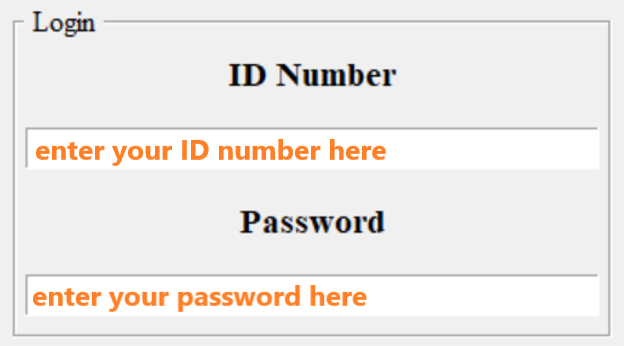
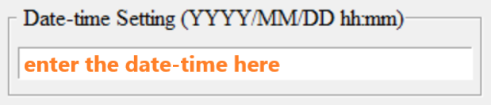
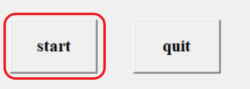
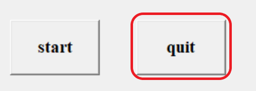

# CPE-Sign-Up

## How to use it?

### Login

### Date-Time Setting

Input the starting time when the sign up begin.
Format: YYYY/MM/DD hh:mm
e.g. 2023/01/01 13:14

#### start the program

As you finished all the settings, you can click the start button to let the program count down, and wait for the result.

#### quit the program

As the program is done or you want to abort the program, you can click the quit button to close the window.

